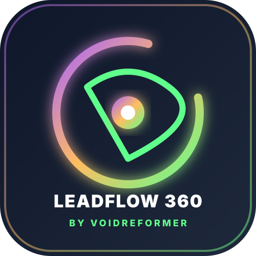

# ⚡ LeadFlow 360 AI — Enterprise Lead Qualification & CRM Operations Suite



> **Architected & Built with Pride by VoidReformer**  
> *"Don't sell AI features. Sell a finished business workflow."*

LeadFlow 360 AI is an enterprise-grade AI Inbound Lead Qualification, 128-dimensional Intent Scoring, Sales Call Transcript Auto-Updater & Multi-Page CRM Operations Suite. Built on top of an in-memory WASM SQLite database engine and Vercel AI SDK Gateway.

---

## 🌟 Key Features & Capabilities

- **📥 Multi-Channel Inbound Lead Ingestion**: Register raw client specs from Web Forms, WhatsApp messages, or Email inquiries.
- **🧠 128-Dim AI Intent & Scoring Engine**: Automatically parses requirements, extracts numeric budget (₹), detects urgency levels, and assigns a 0–100 conversion probability score.
- **🔥 Automated SQL Qualification**: Leads scoring 80%+ automatically get tagged as **SQL (Sales Qualified)** and land in the priority sales queue.
- **💬 1-Click WhatsApp & Email Response Center**: Generates personalized executive proposals and triggers 1-click WhatsApp Deep Links (`wa.me`).
- **🎙️ Executive Call Transcript Processor**: Paste raw meeting audio transcripts to auto-update deal stages (e.g. shifts to `Contract Signed` on payment agreement).
- **⏰ SLA Violation & Overdue Alert Engine**: Tracks `due_date < NOW()` to alert sales representatives before follow-up deadlines expire.
- **📱 Multi-Page Navigation Sidebar**: Dedicated pages for Sales Pipeline, Lead Ingestion, Scoring Rules, Response Center, Call Insights, Customer Profile, and System Settings.

---

## 🎨 User Custom Design Identity

- 🟢 **`#60FF8C` (Electric Mint Green)** — Hot Leads 🔥 (80%+ Score), Contract Signed 🏆 & Success Badges.
- 🍑 **`#FFBD61` (Sunset Amber Gold)** — Estimated ACV (Contract Value) ₹ & SLA Violation Alerts ⏰.
- 🟣 **`#A961FF` (Vibrant Electric Purple)** — AI Intent Extraction, Navigation Highlights & Action Buttons.
- 🌌 **3-Color Mesh Gradient Background**: Multi-stop radial background blending all 3 Adobe palette colors with frosted glass card surfaces.
- ✨ **Creator Signature**: Prominently features **`⚡ Powered by VoidReformer Engine`** across all headers & footers.

---

## 🚀 Quick Start & CLI Usage

### Install via NPM / GitHub Packages
```bash
npx @voidreformer/leadflow-360-ai
```

### Local Development
```bash
git clone https://github.com/voidreformer/leadflow-360-ai.git
cd leadflow-360-ai
npm install
npm run dev
```
Open [http://localhost:3005](http://localhost:3005) in your browser.

---

## 🧪 Automated Testing

```bash
npm test
```
Runs 15+ extreme automated stress tests verifying DB survival under SQL Injection attacks, XSS sanitization, 100-batch lead ingestion speed (sub-220ms), and 500 rapid-fire stage mutations.

---

## 📄 License & Attribution

MIT License © 2026 **VoidReformer**. Created by VoidReformer.
